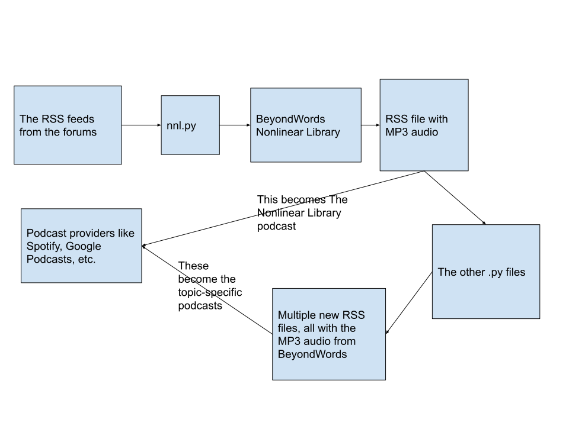
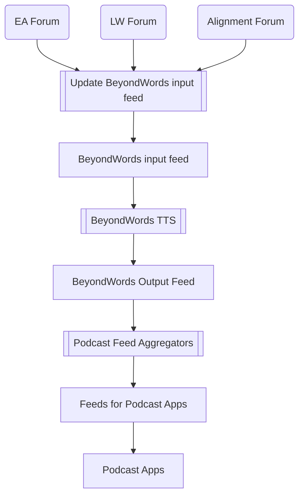
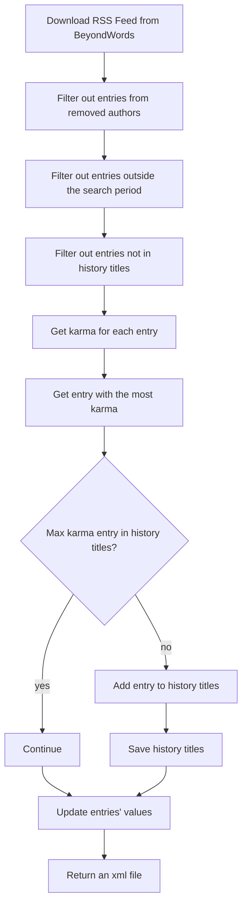

# The-Nonlinear-Library

This project takes in RSS feeds from three different EA-related forums and outputs a modified RSS feed which Nonlinear
uses to create The Nonlinear Library podcast and its variations.

## Overview

This project cleans up and organizes several RSS files which are read by podcast services such as Spotify, Apple
Podcasts, etc., to create The Nonlinear Library and several related podcasts.

The Python files you see in this project can be run locally by running the files in the `manual_tests` directory. They
have also been uploaded to GCP Functions where they are triggered periodically.

### The control flow

The control flow through this project is illustrated in  and described below.

### The new control flow

The control flow through this project begins when `nnl.py` parses new posts from each of the 3 forums, then outputs that
to a
public file in Cloud Bucket which
[this BeyondWords project](https://dash.beyondwords.io/dashboard/project/8692/content) takes in and synthesizes to form
a new RSS feed containing XML segments linking to the audio MP3 synthesis of each of the posts in the RSS / XML file.

Next, the other Python files will be triggered by GCP to take the RSS feed that was output
by [that BeyondWords Project](https://dash.beyondwords.io/dashboard/project/8692/content)
and create new RSS files in Cloud Bucket, which we use to create podcasts specific to the EA, AF, and LW forums.

### The Podcast Feed Generator control flow

###

## Testing

First run the code in `aggregations` manually to output files to your local system. After you've committed and pushed
your changes, deploy and manually trigger the Cloud Functions through the Developer Console.

## Developer Tips

### Using IntelliJ

In order to open the project directly from GitHub, you need to login to your account on IntelliJ (which you can do in
Settings) and also allow access to the Nonlinear-EA organization through your account using
[this link](https://github.com/settings/connections/applications/58566862bd2a5ff748fb).

To set up the Python interpreter,
follow [these instructions](https://www.jetbrains.com/help/idea/creating-virtual-environment.html).

Also, it's going to be more convenient if you're using IntelliJ if you automatically format the code before you commit
it. You can do so following these steps:

1) Go to Settings.
2) Select Editor>Code Style then for Scheme select IDE Default. (This scheme follows the PEP standards. If we all use
   the same scheme, it'll prevent us from reformatting each other's code. Any contributors not using IntelliJ can
   probably avoid most reformattings by just using a formatter that follows PEP.)
3) Select Git>Commit to open the Commit dialog.
4) Check the "Reformat Code", "Rearrange Code", "Optimize Imports" boxes. If you're using the modal dialog, you need to
   select the little gear icon to see these checkboxes.

IntelliJ will show you little warnings when your code goes past the line limit, or you have too many lines between
your method signatures. I suggest disabling these warnings when they come up, and checking the boxes mentioned above so
the IDE automatically formats the code for you. This'll save you time.
